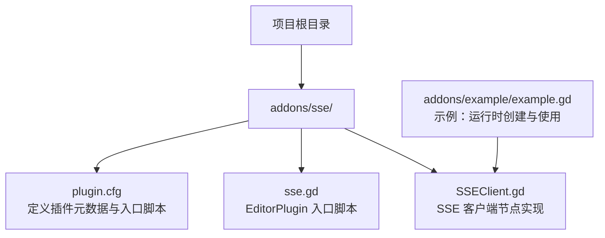
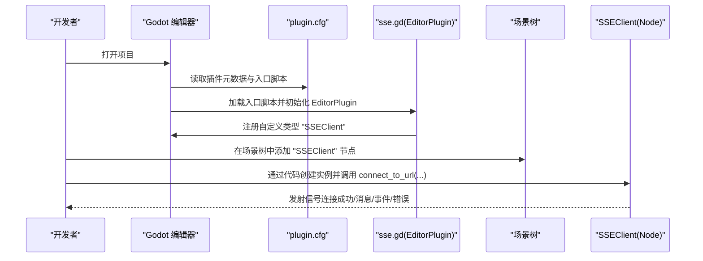
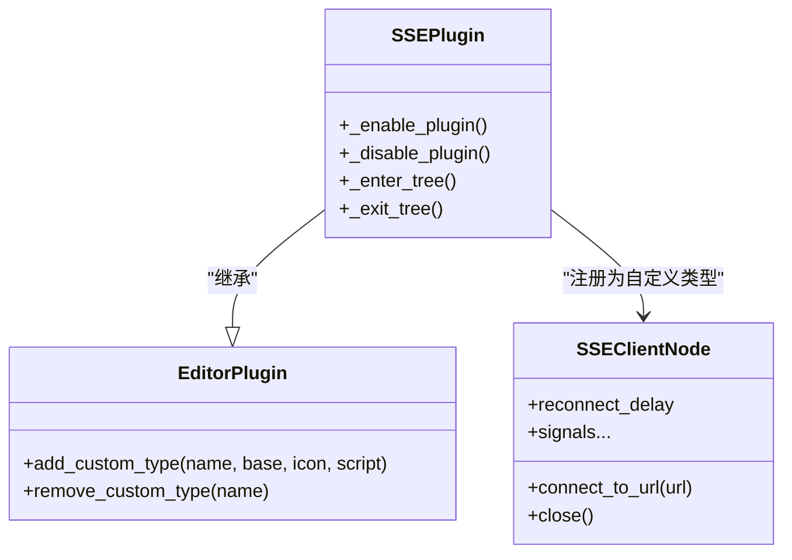
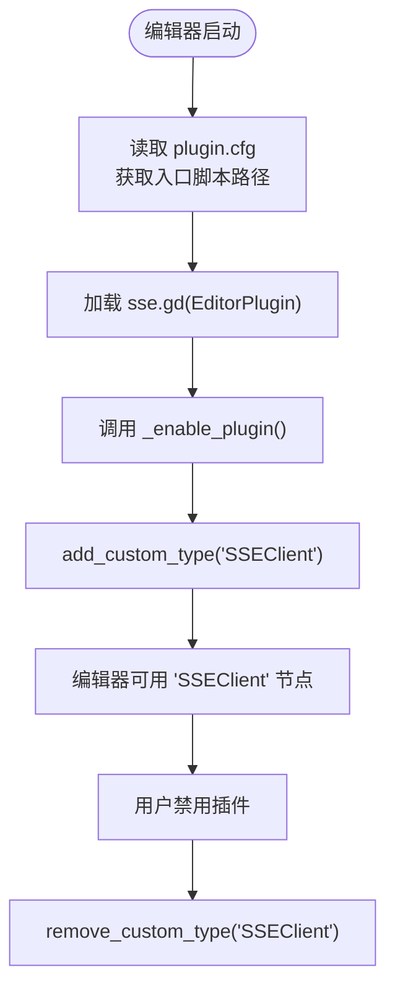
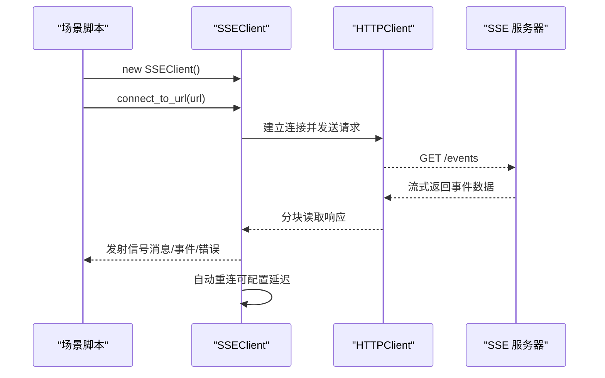
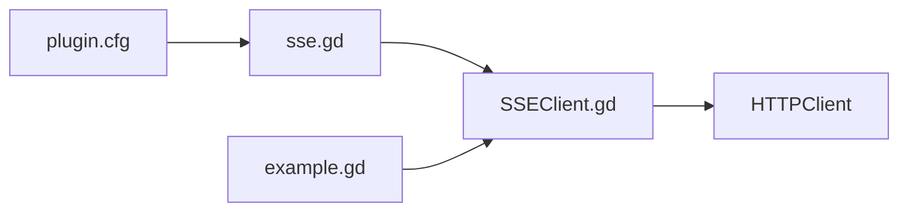

# 安装与配置

<cite>
**本文引用的文件**
- [addons/sse/plugin.cfg](file://addons/sse/plugin.cfg)
- [addons/sse/sse.gd](file://addons/sse/sse.gd)
- [addons/sse/SSEClient.gd](file://addons/sse/SSEClient.gd)
- [addons/example/example.gd](file://addons/example/example.gd)
</cite>

## 目录
1. [简介](#简介)
2. [项目结构](#项目结构)
3. [核心组件](#核心组件)
4. [架构总览](#架构总览)
5. [详细组件分析](#详细组件分析)
6. [依赖关系分析](#依赖关系分析)
7. [性能考虑](#性能考虑)
8. [故障排查指南](#故障排查指南)
9. [结论](#结论)
10. [附录](#附录)

## 简介
本章节面向希望在 Godot 项目中集成并使用 godot-sse 插件的开发者。文档围绕标准安装流程、插件元数据与入口脚本、编辑器启用机制、EditorPlugin 的工作原理（尤其是自定义节点注册）、以及通过代码手动创建 SSEClient 实例等关键点展开，帮助用户从零开始完成插件的安装与配置，并在项目中正确使用 SSEClient 节点进行服务端推送事件的接收与处理。

## 项目结构
godot-sse 插件采用标准的 Godot 插件目录组织方式：将插件资源放置于 addons/<插件名>/ 目录下，其中：
- 插件元数据与入口脚本由 plugin.cfg 与 sse.gd 驱动
- SSEClient 节点逻辑位于 SSEClient.gd
- 示例脚本 example.gd 展示了如何在运行时创建并使用 SSEClient

图表来源
- [addons/sse/plugin.cfg](file://addons/sse/plugin.cfg#L1-L8)
- [addons/sse/sse.gd](file://addons/sse/sse.gd#L1-L27)
- [addons/sse/SSEClient.gd](file://addons/sse/SSEClient.gd#L1-L312)
- [addons/example/example.gd](file://addons/example/example.gd#L1-L46)

章节来源
- [addons/sse/plugin.cfg](file://addons/sse/plugin.cfg#L1-L8)
- [addons/sse/sse.gd](file://addons/sse/sse.gd#L1-L27)
- [addons/sse/SSEClient.gd](file://addons/sse/SSEClient.gd#L1-L312)
- [addons/example/example.gd](file://addons/example/example.gd#L1-L46)

## 核心组件
- 插件元数据与入口脚本
  - plugin.cfg：声明插件名称、作者、版本及入口脚本（sse.gd），供 Godot 在编辑器中识别与加载。
  - sse.gd：继承 EditorPlugin，在启用时注册自定义节点“SSEClient”，禁用时移除该类型，使用户可在场景树中直接添加该节点。
- SSEClient 节点
  - SSEClient.gd：继承 Node，封装 HTTPClient 连接、SSE 协议解析、事件分发（信号）与自动重连逻辑。
- 示例用法
  - example.gd：演示如何在运行时创建 SSEClient 实例、订阅其信号并在场景中启动连接。

章节来源
- [addons/sse/plugin.cfg](file://addons/sse/plugin.cfg#L1-L8)
- [addons/sse/sse.gd](file://addons/sse/sse.gd#L1-L27)
- [addons/sse/SSEClient.gd](file://addons/sse/SSEClient.gd#L1-L312)
- [addons/example/example.gd](file://addons/example/example.gd#L1-L46)

## 架构总览
下图展示了插件在编辑器中的加载与节点注册流程，以及运行时节点的使用方式。

图表来源
- [addons/sse/plugin.cfg](file://addons/sse/plugin.cfg#L1-L8)
- [addons/sse/sse.gd](file://addons/sse/sse.gd#L1-L27)
- [addons/sse/SSEClient.gd](file://addons/sse/SSEClient.gd#L1-L312)
- [addons/example/example.gd](file://addons/example/example.gd#L1-L46)

## 详细组件分析

### 插件元数据与入口脚本（plugin.cfg 与 sse.gd）
- plugin.cfg 的作用
  - 定义插件名称、作者、版本等元信息，用于编辑器插件列表展示。
  - 通过 script 字段指定入口脚本路径（相对于插件目录），Godot 将据此加载并初始化 EditorPlugin。
- sse.gd 的职责
  - 继承 EditorPlugin，使用 @tool 标记以便在编辑器中执行。
  - 在启用时通过 add_custom_type 注册自定义节点“SSEClient”，使其可直接在场景树中添加。
  - 在禁用时通过 remove_custom_type 清理注册，避免残留类型影响其他项目。
  - preload 语句用于加载 SSEClient.gd，确保类型在编辑器中可用。

图表来源
- [addons/sse/sse.gd](file://addons/sse/sse.gd#L1-L27)
- [addons/sse/SSEClient.gd](file://addons/sse/SSEClient.gd#L1-L312)

章节来源
- [addons/sse/plugin.cfg](file://addons/sse/plugin.cfg#L1-L8)
- [addons/sse/sse.gd](file://addons/sse/sse.gd#L1-L27)

### EditorPlugin 工作原理与自定义节点注册
- 启用机制
  - Godot 在加载插件时读取 plugin.cfg 中的 script 字段，定位并执行 sse.gd。
  - sse.gd 在 _enable_plugin 中调用 add_custom_type，向编辑器注册“SSEClient”节点类型。
- 节点可见性
  - 注册完成后，用户可在场景树右键菜单或节点面板中找到“SSEClient”，直接拖入场景。
- 禁用清理
  - 在 _disable_plugin 中调用 remove_custom_type，确保卸载插件时不会遗留类型定义。

图表来源
- [addons/sse/plugin.cfg](file://addons/sse/plugin.cfg#L1-L8)
- [addons/sse/sse.gd](file://addons/sse/sse.gd#L1-L27)

章节来源
- [addons/sse/sse.gd](file://addons/sse/sse.gd#L1-L27)

### SSEClient 节点与运行时使用
- 节点职责
  - SSEClient.gd 封装 HTTPClient 连接、SSE 协议解析、事件分发与自动重连。
  - 提供信号：连接成功、消息到达、事件到达、错误发生。
- 运行时创建与使用
  - 示例脚本 example.gd 展示了如何在场景中创建 SSEClient 实例、订阅其信号，并调用 connect_to_url(...) 启动连接。
  - preload 语句用于加载 SSEClient.gd 类型，确保在编辑器与运行时均可正确识别。

图表来源
- [addons/sse/SSEClient.gd](file://addons/sse/SSEClient.gd#L1-L312)
- [addons/example/example.gd](file://addons/example/example.gd#L1-L46)

章节来源
- [addons/sse/SSEClient.gd](file://addons/sse/SSEClient.gd#L1-L312)
- [addons/example/example.gd](file://addons/example/example.gd#L1-L46)

## 依赖关系分析
- 插件入口依赖
  - plugin.cfg 依赖 sse.gd 作为入口脚本。
  - sse.gd 依赖 SSEClient.gd 作为自定义节点类型。
- 运行时依赖
  - SSEClient.gd 依赖 HTTPClient 进行网络通信，并通过信号对外分发事件。
- 示例依赖
  - example.gd 依赖 SSEClient.gd 并订阅其信号，形成完整的使用闭环。

图表来源
- [addons/sse/plugin.cfg](file://addons/sse/plugin.cfg#L1-L8)
- [addons/sse/sse.gd](file://addons/sse/sse.gd#L1-L27)
- [addons/sse/SSEClient.gd](file://addons/sse/SSEClient.gd#L1-L312)
- [addons/example/example.gd](file://addons/example/example.gd#L1-L46)

章节来源
- [addons/sse/plugin.cfg](file://addons/sse/plugin.cfg#L1-L8)
- [addons/sse/sse.gd](file://addons/sse/sse.gd#L1-L27)
- [addons/sse/SSEClient.gd](file://addons/sse/SSEClient.gd#L1-L312)
- [addons/example/example.gd](file://addons/example/example.gd#L1-L46)

## 性能考虑
- 自动重连策略
  - SSEClient 支持可配置的重连延迟，避免频繁重试造成资源浪费。
- 流式解析
  - 使用缓冲区与事件边界检测，按完整事件分发，减少重复解析与内存拷贝。
- 连接状态轮询
  - 在 _process 中仅在连接进行中轮询，避免不必要的 CPU 占用。

章节来源
- [addons/sse/SSEClient.gd](file://addons/sse/SSEClient.gd#L1-L312)

## 故障排查指南
- 插件未出现在编辑器插件列表中
  - 检查 addons/sse/plugin.cfg 是否存在且 script 指向正确的入口脚本路径。
  - 确认插件目录结构完整：addons/sse/plugin.cfg 与 sse.gd 必须在同一目录下。
- 自定义节点“SSEClient”不可见
  - 确认插件已在编辑器中启用；若已启用仍不可见，尝试重启编辑器。
  - 检查 sse.gd 中是否正确调用了 add_custom_type 注册类型。
- 运行时报错无法加载类型
  - 确保 preload 语句指向的路径与实际文件一致（相对插件目录）。
  - 确认 SSEClient.gd 文件存在于插件目录中。
- 连接失败或无事件到达
  - 检查 connect_to_url(...) 传入的 URL 是否正确，协议与端口是否匹配。
  - 查看错误信号输出，确认网络层状态与服务器返回内容。

章节来源
- [addons/sse/plugin.cfg](file://addons/sse/plugin.cfg#L1-L8)
- [addons/sse/sse.gd](file://addons/sse/sse.gd#L1-L27)
- [addons/sse/SSEClient.gd](file://addons/sse/SSEClient.gd#L1-L312)

## 结论
godot-sse 插件通过标准的 Godot 插件机制实现了编辑器内节点注册与运行时功能扩展。借助 plugin.cfg 的元数据与入口脚本 sse.gd，用户可在编辑器中直接添加“SSEClient”节点；同时，SSEClient.gd 提供了完善的 SSE 协议解析与事件分发能力。按照本文档的安装与配置步骤，结合示例脚本，即可快速在项目中集成并使用该插件。

## 附录
- 安装步骤（概要）
  1) 将 addons/sse 目录复制到你的 Godot 项目的根目录下。
  2) 在编辑器中打开“插件”面板，启用 godot-sse 插件。
  3) 在场景树中添加“SSEClient”节点，或在脚本中通过 new SSEClient() 创建实例。
  4) 订阅并处理 SSEClient 发出的信号，调用 connect_to_url(...) 启动连接。
- 参考文件路径
  - 插件元数据与入口脚本：addons/sse/plugin.cfg、addons/sse/sse.gd
  - 节点实现与示例：addons/sse/SSEClient.gd、addons/example/example.gd

章节来源
- [addons/sse/plugin.cfg](file://addons/sse/plugin.cfg#L1-L8)
- [addons/sse/sse.gd](file://addons/sse/sse.gd#L1-L27)
- [addons/sse/SSEClient.gd](file://addons/sse/SSEClient.gd#L1-L312)
- [addons/example/example.gd](file://addons/example/example.gd#L1-L46)
